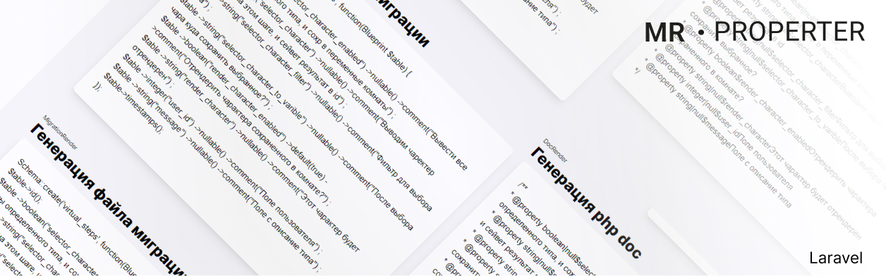

<p align="center">

</p>

## MathSolutionFinder

Кароч изи пакет для матиматической гавна комбинаторики помойных данных на пхп.

## Установка из composer

```  
composer require slavawins/mathsolutionfinder
```

## Просто пример использования
Самое простое что я придумал это найти максимальное значение между двуми перемножиными числами. Понятно и так что ответ будет - два переменоженных числа.

```  
use MathSolutionFinder\Library\MathSolutionFinder;

        $module = MathSolutionFinder::New()->SetMode()->Max()
            ->AddPropertyRange("one", 1, 100, 6)
            ->AddPropertyRange("two", 1, 5, 10)
            ->SetCallable(function ($data) {
                return $data['one'] * $data['two'];
            });

        $result = $module->Learn();
        dump($result);        
        
```

Получится вот такой результат:

    array:2 [
          0 => 500
          1 => array:2 [
            "one" => 100
            "two" => 5
          ]
    ]

Мы создаем класс. И говорим что хотим высчитать максимальную сумму.
$module = MathSolutionFinder::New()->SetMode()->Max()


Далее с помощью: ->AddPropertyRange("one", 1, 100, 6) Добавлем свойство которое нужно рассчитывать. Назвываться оно будет one и будет иметь значение от 1 до 100. 6 это сколько вариантов для этого числа нужно для рассчетов.
Чем больше число, тем точнее результат. Но больше нагрузка.

Затем вываем   ->SetCallable(function ($data) { всё что внутри этой функции это рассчет, он будет выполнятся пока не переберутся все комбинации свойств.

   
